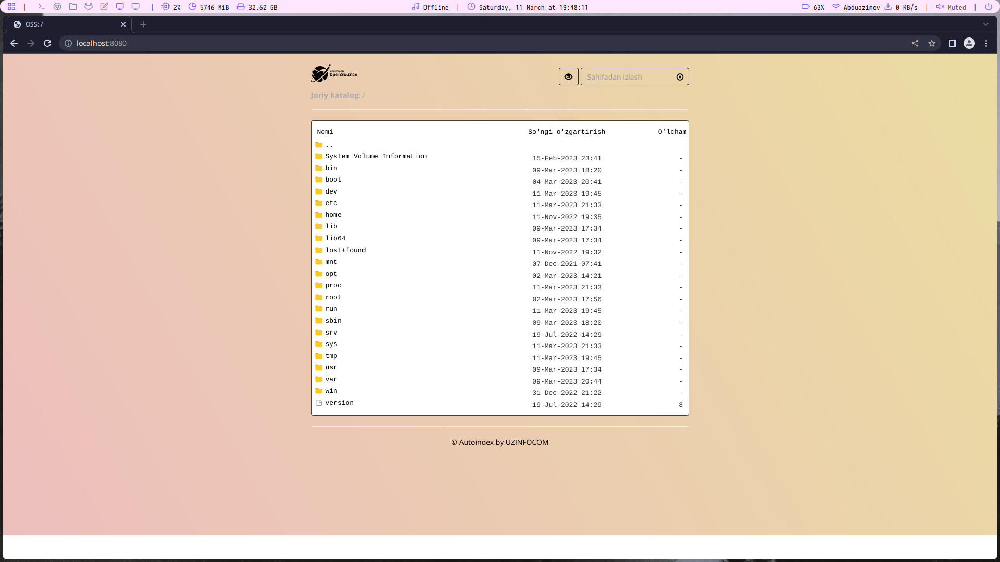
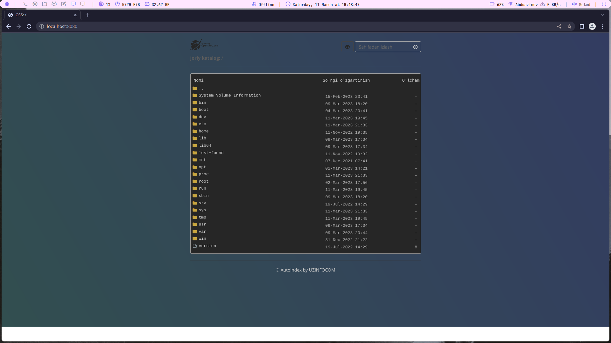

# oss-autoindex
🕸️ | Custom autoindex directory listing for nginx

#### Light Mode


#### Dark Mode



Copy .html folder to the folder you want to index and add the location.config file to nginx server.

Sample server:

```
server{
        listen 80;

        root /media/files;

        server_name _;

        location / {
               try_files $uri $uri/ =404;
               add_before_body /.html/top.html;
               add_after_body /.html/bot.html;
               autoindex on;
               autoindex_localtime on;
               autoindex_exact_size on;
               sub_filter '<html>' '';
               sub_filter '<head><title>Index of $uri</title></head>' '';
               sub_filter '<body bgcolor="white">' '';
               sub_filter '</body>' '';
               sub_filter '</html>' '';
               sub_filter_once on;
        }
}
```